# 加密货币交易入门：如何在OKX平台购买和出售加密货币

---

想要用本地货币买卖加密货币？别担心，其实没那么复杂。我自己用的是OKX，这个平台界面挺友好的，功能也齐全，关键是不会因为你的国籍就把你拒之门外。下面我就用最简单的话，跟你聊聊怎么在OKX上操作——从注册到真正完成交易，每一步都说清楚。

---

## 第一步：在OKX注册账户

### 创建你的账号

这部分真的没啥好说的，跟你平时注册其他网站一样——手机号、邮箱或者Telegram账号，选一个就行。电脑上操作和手机上操作都差不多，界面很直观。

### 完成身份验证

这一步比较关键。要想正常使用平台功能，至少得通过二级验证。你需要准备好护照——拍照上传那种。

**用手机操作更方便**

手机摄像头比笔记本的webcam清晰多了。打开OKX应用后，点左上角的头像图标，找到"身份验证"这一项。

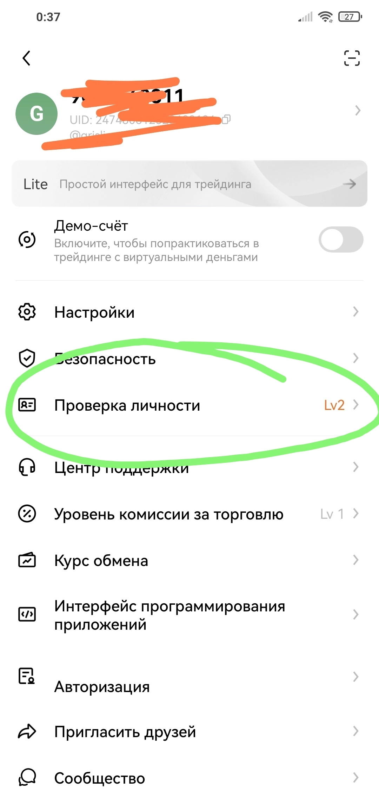

一级验证很简单，就是输入护照号码和相关信息。可以用普通护照，选"国家身份证"那个选项。

二级验证需要你在应用里直接拍照——拍护照主页（有你照片和签发日期的那一页），记得别选"塑料卡"，选"其他"。还得来张自拍。

**小提示**：找个光线好的地方拍，别让反光遮住文字或你的脸。

一般来说，二级验证就够用了，能应付挺大额度的交易。三级验证按需来就行。

**电脑上操作**

鼠标移到右上角的头像图标上，会弹出菜单，点"身份验证"。

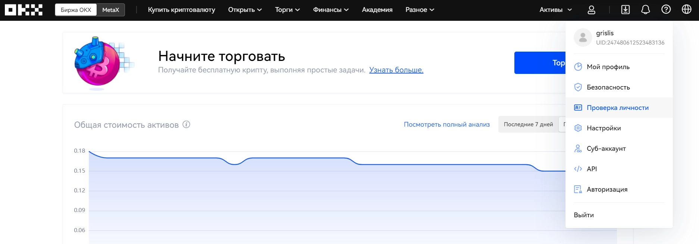

接下来跟手机版一样——按照提示输入护照信息，拍照，自拍，搞定。

## 第二步：添加银行卡或账户

要用本地货币买卖加密货币，你得先在个人资料里添加支付方式。

在俄罗斯的话，可能是Tinkoff或Sber的卡；在欧洲的话，一般就用银行转账（需要你的IBAN）。

进入"购买加密货币"板块，右边找"详细信息"按钮，点进去找"设置"。

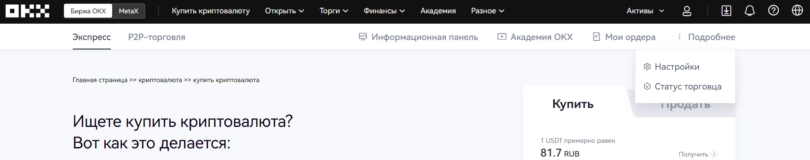

往下滚动到"支付方式"，点"+添加"。

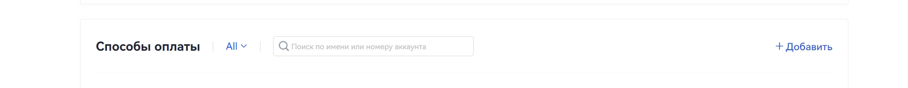

在弹出的窗口里选你的银行，输入卡号信息。

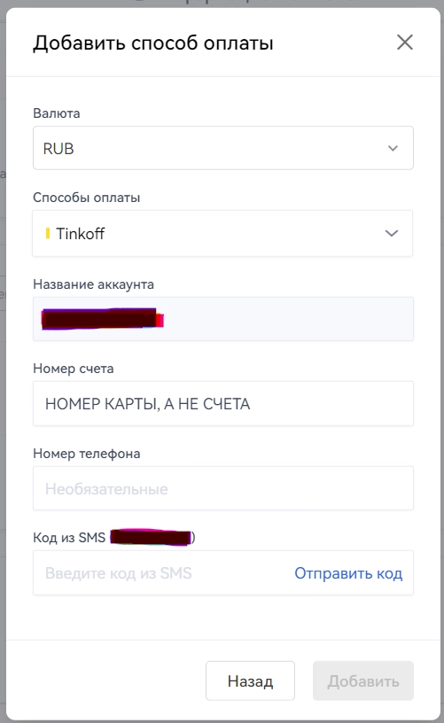

支付方式添加完成。手机端操作流程也一样。

## 第三步：购买或出售加密货币

验证搞定了，支付方式也添加了，现在可以开始交易了。

添加支付方式后，进入"P2P交易"板块。这里你可以跟其他用户买卖加密货币，平台会充当担保方，保证交易安全。

### 买入加密货币

顶部选"买入"，右边选你想买的币种（比如稳定币USDT），再右边选你要用的本地货币（比如卢布）。

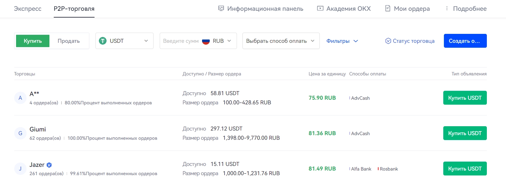

你会看到一堆卖家列表。注意这几点：

- 可交易金额——得满足你想买的数量
- 订单限额——卖家设置的最小和最大金额。比如上面截图里的那位，最少得买100卢布的
- 支付方式——卖家支持的支付方式得跟你添加的匹配，不然交易不了

找到合适的卖家后，点"购买USDT"，输入你想买的金额。

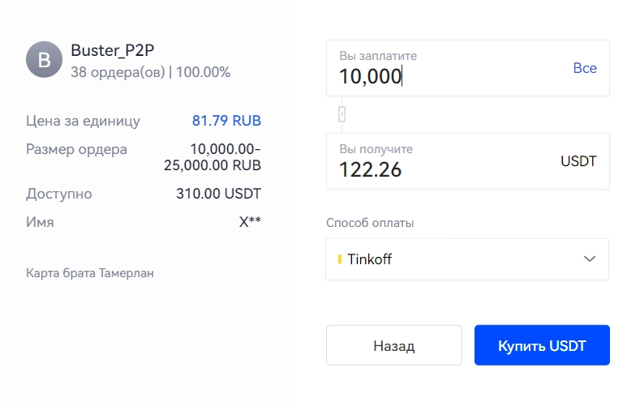

👉 [想要更安全便捷的加密货币交易体验？立即注册OKX](https://www.okx.com/join/62834398)

点"购买USDT"按钮后，你会进入交易聊天室，里面会显示卖家的卡号——把钱转过去就行。

卖家确认收到款后，加密货币就会打到你账户上。

### 卖出加密货币

顶部选"卖出"，右边选你要卖的币（比如BTC），再右边选你想收的本地货币（比如卢布）。

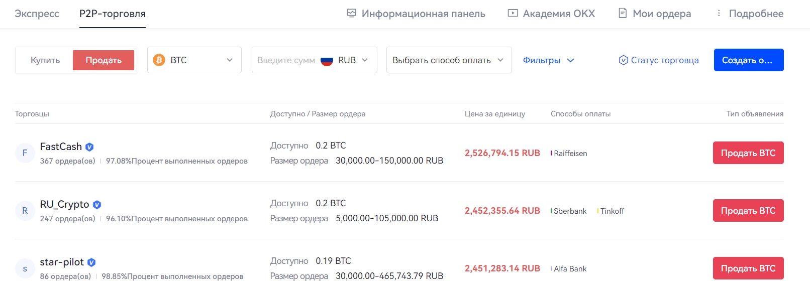

跟买入一样，挑个合适的买家，注意他的限额和支付方式。

点"卖出"，输入金额，再点一次"卖出"。

进入聊天室后，等买家的钱打到你卡上——**确认收款后**再点"发送加密货币"按钮。这个顺序别搞反了。

## 第四步：加密货币之间的兑换

假设有人给你转了BTC，你想换成更稳定的币，比如USDT（锚定美元的稳定币），这个很简单：

顶部点"交易"，选"兑换"。

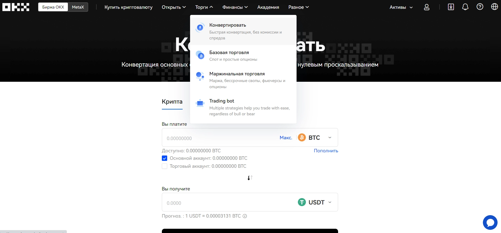

弹出窗口里选你要兑出的币（比如BTC）和想换成的币（比如USDT）。输入金额，点"兑换"。这个过程是自动的，不需要跟其他人交易。

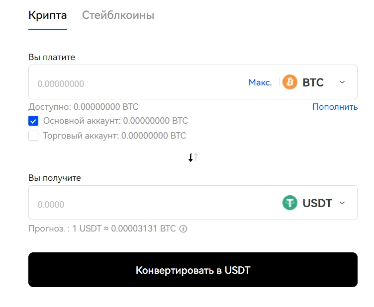

搞定！你把比特币换成了稳定币，现在可以按相对稳定的汇率换成卢布，或者做其他用途。

## 第五步：接收加密货币转账到平台

如果你不是自己买币，而是想让别人把币转到你在OKX的账户上，这样操作：

顶部找"资产"按钮，点"充值"。

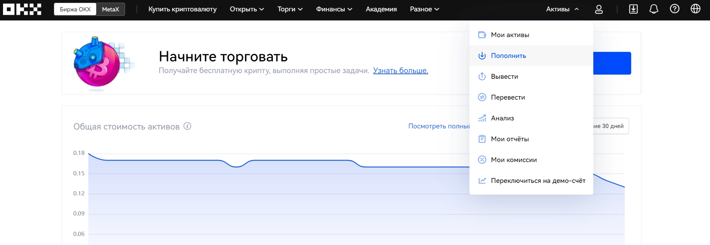

选你要接收的币种，然后——**非常重要**——选对网络。比如比特币(BTC)可以通过主网BTC-Bitcoin接收，也可以通过BTC-Lightning网络接收。一定要问清楚对方用哪个网络转账，然后再告诉他你的地址。

充值窗口长这样：

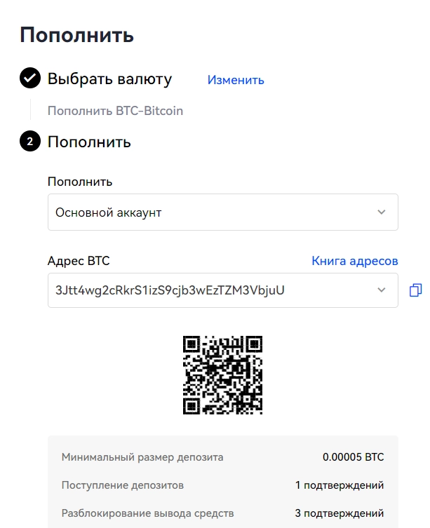

想查看你在平台上的所有资产，去"我的资产"——在顶部"资产"菜单里能找到。从那里也能充值。

---

说到底，OKX在加密货币交易方面确实挺靠谱的——界面清晰，操作流畅，该有的功能都有。无论你是想把卢布换成加密货币，还是把加密货币换回本地货币，甚至不同币种之间互换，整个流程都挺顺畅的。👉 [立即体验OKX带来的便捷加密货币交易](https://www.okx.com/join/62834398)，开启你的数字资产之旅。
